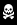
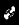
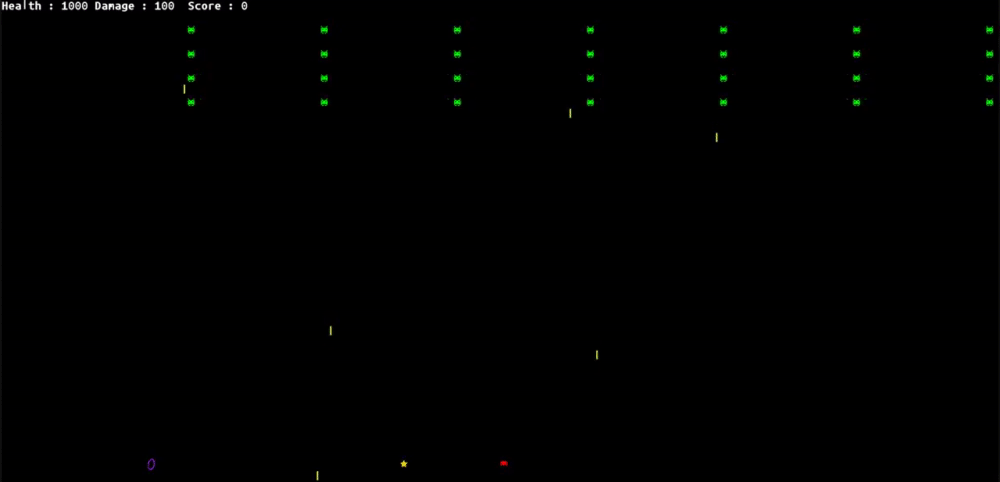

 ## LDTS_TURMA13_GRUPO01 - SPACE INVADERS

## Game Description

In this old school game you play the role of a spaceship trying to survive an attack of flying monsters. Your ultimate goal is to KILL THEM ALL!!!

In this fixed shooter the spaceship moves a laser cannon horizontally across the bottom of the screen and fires at aliens overhead.

Some features were added by us to make the gameplay feel more original and fun.
The main features consist of spells or powerUps that enhance or "sabotage" the Spaceship :)

This project was developed by João Reis (up202007227) Pedro Gomes (up202006322) Rui Pires (up202008252).

## Screenshots

The following screenshots ilustrate the general look of our game, as well as the divergent functionalities:
### Game preview

  

  <b><i>Fig1. Sneak peak into the Space Invaders game</i></b>

 
 

### Spells

  

  <b><i>Fig 2. HealthSpell </i></b>

  

  <b><i>Increments SpaceShip Health </i></b>

  
 
 

  

  <b><i>Fig 3. Nerfed SpaceShip Spell</i></b>

  

  <b><i>"Nerfs" the  SpaceShip making it unable to shoot for 10 seconds. </i></b>

 

 
 

  

  <b><i>Fig 4. InvincibleSpaceShip Spell</i></b>

  

  <b><i>Enhances the SpaceShip 10 seconds, immune to all damage. </i></b>

 
 
 

  

  <b><i>Fig 5. Health Damage Spell </i></b>

  <b><i>Decrements SpaceShip Health </i></b>

 
 
 

  

  <b><i>Fig 6. More Damage Spell </i></b>

  <b><i>Increments SpaceShip Damage </i></b>

 
 
 

  

  <b><i>Fig 7. Less Damage Spell </i></b>

  <b><i>Decrements SpaceShip Health </i></b>

 

 
 

### Animations

  

  <b><i>Gif 1. GamePlay</i></b>

 
 
 
 

  <b><i>To take a closer look at the features we are still planning to implement take a closer look at the other README file!  </i></b>

 

