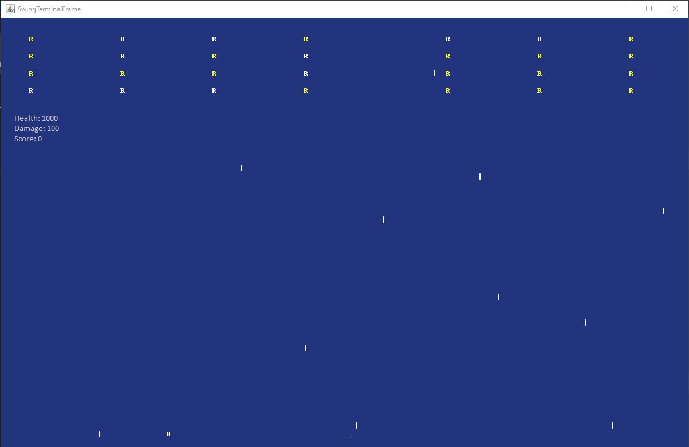
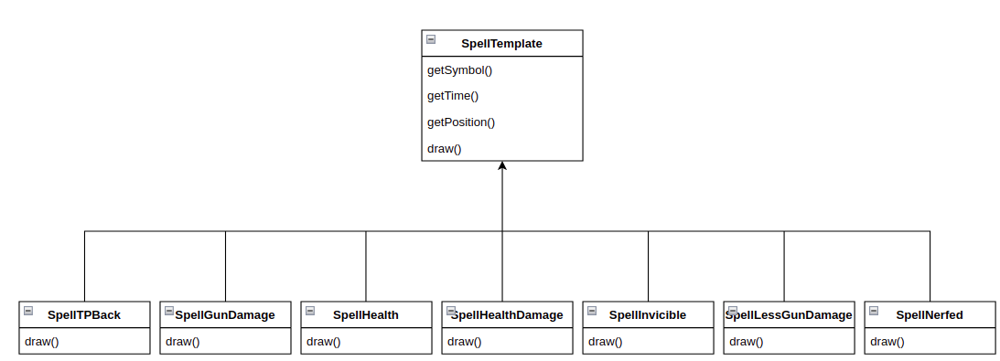
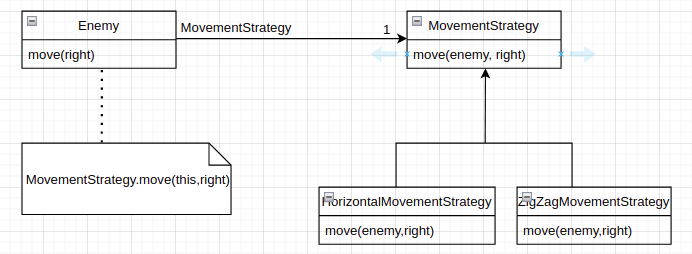
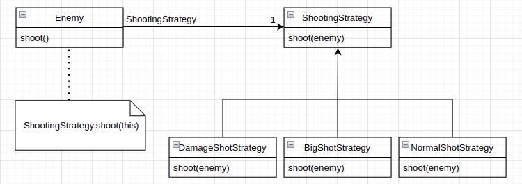
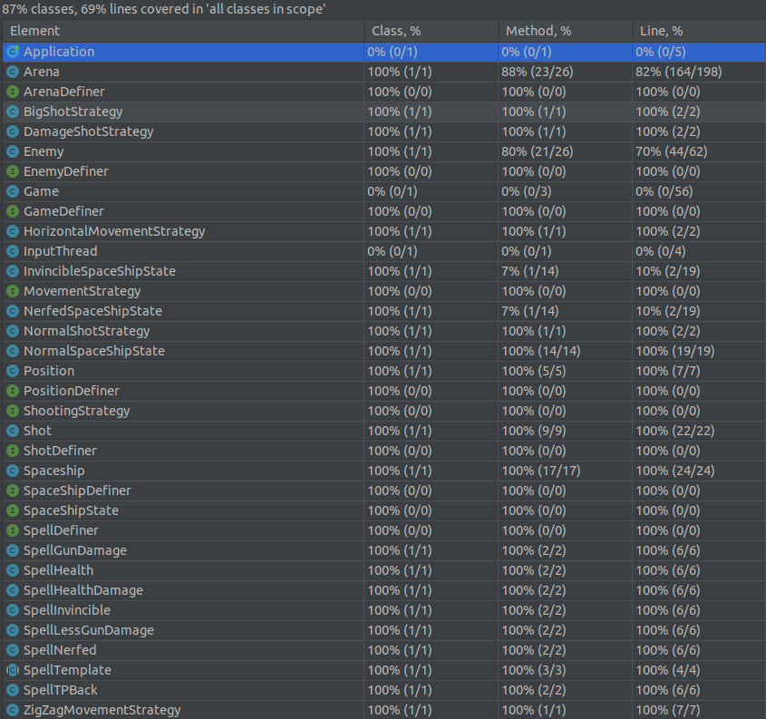

## L_TURMA13_GRUPO01 - SPACEINVADERS

**Example**:

In this old school game you play the role of a spaceship trying to survive an attack of flying monsters. Your ultimate goal is to KILL THEM ALL!!!  

In this fixed shooter the spaceship moves a laser cannon horizontally across the bottom of the screen and fires at aliens overhead. 

This project was developed by João Reis (up202007227) Pedro Gomes (up202006322) Rui Pires (up202008252).

### IMPLEMENTED FEATURES
Moving left: the spaceship will move one square to the left when the "a"  key is pressed.

Moving right: the spaceship will move one square to the right when the "d"  key is pressed.

Shooting: the spaceship will shoot one bullet in a vertical line when the space bar key is pressed.

Spells/PowerUps: During the game, and at random, 7 different types of spells/powerups can spawn on the ground near the spaceship. To resume briefly, 8 of them are implemented:

	Health Spell: Increases the spaceship health a bit.
	Damage
	Increase Spell: Increases the spaceship's damage, permanently.
	InvincibleState Spell: Makes the spaceship immortal for 10secs, which means it can't take damage.
	NerfedState Spell: Makes the spaceship unable to shoot any bullet for 10secs.
	HealthReducer Spell: Takes a fraction of the spaceship's health points.
	DamageReducer Spell: Reduces the spaceship's damage, permanently.
	
Different waves of enemies: There are infinite waves of enemys, which means the user could play forever if he doesn't lose. The movement of the enemies can also vary depending on the wave. They can move on a straight line simply to the right, or they can reproduce a zig-zag like motion up and down while also moving to the right. The enemies health scales with the number of the wave in which he's a part of. 
	
	
### PLANNED FEATURES

For the future we are planning to implement our last spell which will be the "TeleportBackSpell". It will basically allow the user to teleport to the place where he first caught the spell, by pressing the "t" key character.
We're also planning to create a user menu interface.
And we are planning to also add information on the top of the game regarding the players health, spaceship damage and his current score (1point for each alien killed).

How the game will look like after the previous feauture is implemented:

  

### DESIGN

------

### Template Method Pattern

#### **Problem in Context**

When creating the different spells, we noticed that there was a lot of duplicate code (in the getters) and that the only difference in each class was in the constructor and in the draw method.

#### **The Pattern**
We have applied the **_Template Method_** pattern. A template lets subclasses extend only particular methods of the parent class.

#### **Implementation**
We set the common methods (the getters) as final in the parent class SpellTemplate and we let the subclasses override the methods which diverge in each spell (the draw method)

  

#### **Consequences**

The template method allows the following consequences:
- We pulled the duplicate code to the parent class.
- In case we want to add a new spell in the future,
it might be limited to the provided skeleton of the parent class.

### Strategy Pattern

#### **Problem in Context**

The enemies of our game have different strategies for shooting and moving.
To implement them both efficiently we used the Strategy Pattern, so we can add all the different ways the enemies can move or shoot without increasing the chance of creating an error in an already working code.

#### **The Pattern**
We applied the **_Strategy Pattern_** which is a behavioral design pattern that lets you define multiple algorithms, in separate classes, and make their objects interchangeable.

#### **Implementation**
Regarding the implementation, we now have classes which define the way the enemy is supposed to shot or to move.

  
  

#### **Consequences**
The strategy pattern allows the following consequences:
- We can isolate the implementation of an algorithm from the code that uses it.
- We can introduce new strategies without having to change the context.

#### KNOWN CODE SMELLS AND REFACTORING SUGGESTIONS

#### **Duplicate Code**
Inadequate implementation of the state pattern which lead to duplicate code (3 classes with the same code).
Duplicate code to generate a random spell.
We didn't use packages yet.

#### **Large Class**
Some classes (Arena) contain many fields and others (Enemy, Spaceship) contain many methods.

In both cases, we find it justifiable as the classes require these fields, in one hand the Arena class is basically the main class of the program and it needs to store a considerable amount of data, on the other hand various methods are needed for the Enemy and Spaceship classes and it wouldn't make sense to split each class into two separate ones.

#### **Switch Statements**
There is switch statement in the addSpell method. However, the switch operator performs simple actions.

------

#### DATA CLASS

### TESTING
Test coverage report:

  

Note that getters and setters were not tested due to the triviality of the matter.
Game, Application and InputThread are also not tested.

### SELF-EVALUATION
So far up until this point, the workflow was very dynamic between all group members and the work was distributed equally. Everyone was motivated to contribute to the assignment.

