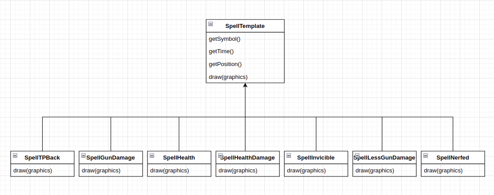

## L_TURMA13_GRUPO01 - SPACEINVADERS

**Game Description**:

In this old school game you play the role of a spaceship trying to survive an attack of flying monsters. Your ultimate goal is to KILL THEM ALL!!!  

In this fixed shooter the spaceship moves a laser cannon horizontally across the bottom of the screen and fires at aliens overhead. 

This project was developed by João Reis (up202007227) Pedro Gomes (up202006322) Rui Pires (up202008252).

### IMPLEMENTED FEATURES
Menu Interface: We implemented a menu interface that pops up when the application starts running.
It helps the user choosing whether he wants to play or quit the game. To alternate between the options simply press arrow up or arrow down. To quit the game while playing the user needs to press the "q" key or simply end up losing the game.

Information on Run-Time: We successfully developed a way of showing the player information about what's going on while he/she's playing the game. Mainly information about the spaceship's health, its damage and score.

GameOver Interface: After the user loses the game a screen containg a GAME OVER message pops up and also lets the user know his score at the end of the game.

Moving left: the spaceship will move one square to the left when the "a"  key is pressed.

Moving right: the spaceship will move one square to the right when the "d"  key is pressed.

Shooting: the spaceship will shoot one bullet in a vertical line when the space bar key is pressed.

Spells/PowerUps: During the game, and at random, 7 different types of spells/powerups can spawn on the ground near the spaceship:

	Health Spell: Increases the spaceship health a bit.
	Damage Increase Spell: Increases the spaceship's damage, permanently.
	InvincibleState Spell: Makes the spaceship immortal for 10secs, which means it can't take damage.
	NerfedState Spell: Makes the spaceship unable to shoot any bullet for 10secs.
	HealthReducer Spell: Takes a fraction of the spaceship's health points.
	DamageReducer Spell: Reduces the spaceship's damage, permanently.
    TeleportBack Spell: The spaceship can teleport back to where it first caught 
                        this spell by pressing the "t" key
	
Different waves of enemies: There are infinite waves of enemys, which means the user could play forever if he doesn't lose. The movement of the enemies can also vary depending on the wave. They can move on a straight line simply to the right, or they can reproduce a zig-zag like motion up and down while also moving to the right. The enemies health scales with the number of the wave in which he's a part of. 
	
	
### PLANNED FEATURES

All the planned features were implemented successfully!

### DESIGN

#### General Class Diagram 

  
images/uml.png

------

### Template Method Pattern

#### **Problem in Context**

When creating the different spells, we noticed that there was a lot of duplicate code (in the getters) and that the only difference in each class was in the constructor and in the draw method.

#### **The Pattern**
We have applied the **_Template Method_** pattern. A template lets subclasses extend only particular methods of the parent class.

#### **Implementation**
We set the common methods (the getters) as final in the parent class SpellTemplate and we let the subclasses override the methods which diverge in each spell (the draw method)

  

#### **Consequences**

The template method allows the following consequences:
- We pulled the duplicate code to the parent class.
- In case we want to add a new spell in the future,
it might be limited to the provided skeleton of the parent class.

### Strategy Pattern

#### **Problem in Context**

The enemies of our game have different strategies for shooting and moving.
To implement them both efficiently we used the Strategy Pattern, so we can add all the different ways the enemies can move or shoot without increasing the chance of creating an error in an already working code.

#### **The Pattern**
We applied the **_Strategy Pattern_** which is a behavioral design pattern that lets you define multiple algorithms, in separate classes, and make their objects interchangeable.

#### **Implementation**
Regarding the implementation, we now have classes which define the way the enemy is supposed to shot or to move.

  
  

#### **Consequences**
The strategy pattern allows the following consequences:
- We can isolate the implementation of an algorithm from the code that uses it.
- We can introduce new strategies without having to change the context.

### Singleton

#### **Problem in Context**

In our game one of the things we need to make sure is not happening is the fact that two instances of the class game could be running at the same time.
The singleton pattern will be extremely helpful in ensuring that won't happen.

#### **The Pattern**
We applied the **_Singleton Pattern_** which is a creational design pattern that makes sure that a class has only one instance and provides a global access point to that instance.

#### **Implementation**
Regarding the implementation, we now have a private game constructor which allows us to make sure there is only one instance of the game class that is returned by the static method getInstance().

  

#### **Consequences**

The singleton has the following consequences:
- We can make sure that there only exits one instance of the game
- We gain a global access point to that game
- The game is only initialized when it's requested for the first time

### Observer

#### **Problem in Context**

In our game we need to know when the player presses the key 't' and notifies the spaceship to return to the position where the player caught the TPBack spell.

#### **The Pattern**
We applied the **_Observer Pattern_** which is a behavioral design pattern that lets us define a subscription mechanism to notify any events that happen to the object they are observing. 

#### **Implementation**

Regarding the implementation, we now have spaceship observer that notifies the spaceship when the player presses 't'. When the spaceship is notified, it will return to the position where the spell was initially, if the spell was indeed caught.

  

#### **Consequences**

The Observer pattern has the following consequences:
- We can create a relation between the spaceship and the spells in run time

#### KNOWN CODE SMELLS AND REFACTORING SUGGESTIONS

#### **Large Class**
Some classes (Arena) contain many fields and others (Enemy, Spaceship) contain many methods.

In both cases, we find it justifiable as the classes require these fields, in one hand the Arena class is basically the main class of the program and it needs to store a considerable amount of data, on the other hand various methods are needed for the Enemy and Spaceship classes and it wouldn't make sense to split each class into two separate ones.

#### **Switch Statements**
There is switch statement in the addSpell method. However, the switch operator performs simple actions.

------

### TESTING
Test coverage report:

  

Mutation Test Coverage: 

  

### SELF-EVALUATION
So far up until this point, the workflow was very dynamic between all group members and the work was distributed equally. Everyone was motivated to contribute to the assignment.

